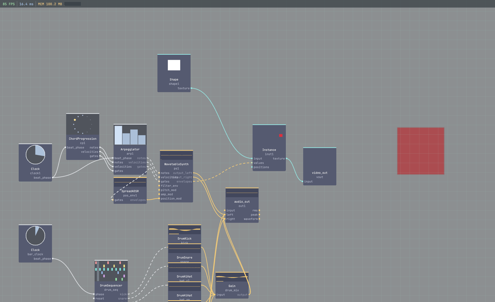

# vivid-wavetable

`vivid-wavetable` is a Vivid package library that provides the `WavetableSynth` audio operator.

## Preview



## Contents

- `src/wavetable_synth.cpp`
- `factory_presets/wavetable_synth.json`
- `graphs/core/wavetable_midi_demo.json` (no external package dependencies)
- `graphs/extended/wavetable_demo.json` (requires `vivid-sequencers`)
- `graphs/extended/wavetable_position_env_demo.json` (requires `vivid-sequencers`)
- `tests/test_package_manifest.cpp`
- `tests/test_wavetable_position_env.cpp`
- `vivid-package.json`

## Local development

From vivid-core:

```bash
./build/vivid link ../vivid-wavetable
./build/vivid rebuild vivid-wavetable
```

## CI smoke coverage

The package CI workflow:

1. Clones and builds vivid-core (`test_demo_graphs` + core operators).
2. Builds package operators and package tests.
3. Runs package tests.
4. Runs graph smoke tests against `graphs/core/`.
5. Optionally runs `graphs/extended/` when `VIVID_RUN_EXTENDED_GRAPHS=1` is set as a repo variable.

## License

MIT (see `LICENSE`).
