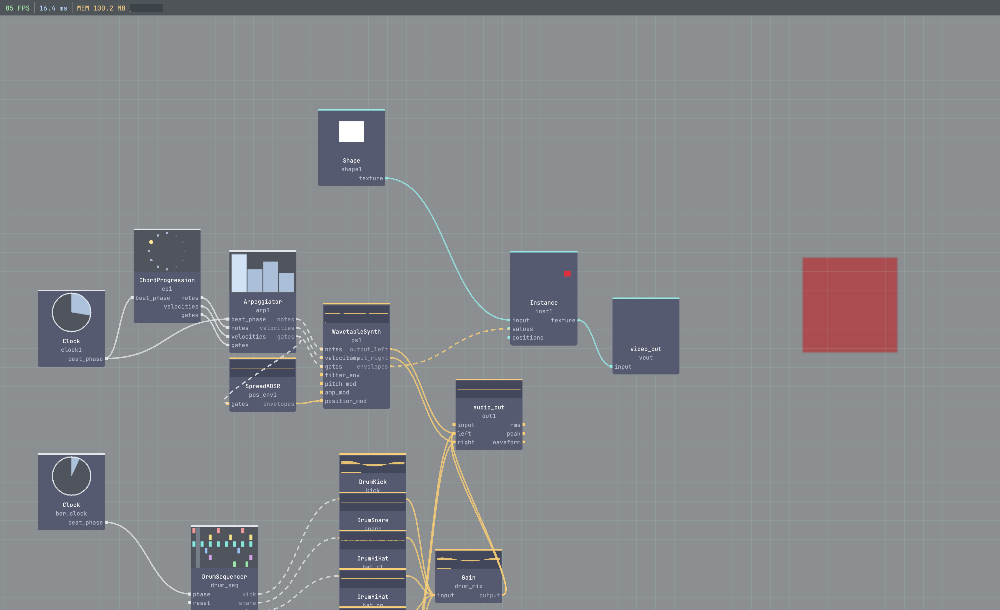

# vivid-wavetable

`vivid-wavetable` is an audio-first modular wavetable synthesis package for Vivid. Active graphs are written against the fixed-cadence core and use `_au` core control operators explicitly where clocking, envelopes, and modulation are needed.

## Preview



## Operators

- **PolyVoiceAllocator** — converts MIDI and control inputs into polyphonic lane arrays (frequencies, gates, velocities, lane_ids) with time-based release retention for long pad tails
- **WavetableLayer** — production polyphonic wavetable renderer with internal unison, stereo summing, and SIMD-ready architecture; outputs stereo directly, replacing the WavetableOsc + VoiceMixer chain for production instruments
- **WavetableOsc** — legacy polyphonic wavetable oscillator with per-voice audio output; retains advanced features (oscillator interaction and feedback-style warp) not present in WavetableLayer
- **AnalogOsc** — polyphonic virtual analog oscillator with PolyBLEP anti-aliasing (sine, saw, square, triangle, pulse) and conditioned oscillator interaction
- **SubOsc** — polyphonic sub oscillator (sine, triangle, saw, square, noise)
- **NoiseLayer** — polyphonic per-note noise/air source for breath, attack detail, and texture layers
- **VoiceDrive** — lane-preserving soft drive for per-voice body, glue, and velocity-sensitive harmonic density
- **VoiceMixer** — sums N-channel per-voice audio to stereo with panning, velocity, envelope control, optional output glue, and stereo-pair width preservation; not needed when using WavetableLayer

## Contents

- `src/` — operator source files
- `modules/` — instrument-facing subgraph modules
- `assets/wavetables/` — factory wavetable wav files for the instrument library
- `factory_presets/` — per-operator factory presets
- `graphs/core/` — core smoke graphs (modular chain + asset smoke)
- `graphs/presets/` — curated showcase library and instrument graphs
- `tests/` — package tests
- `archive/` — frozen monolith-era graphs and tests (not built)

## Local development

From vivid-core:

```bash
./build/vivid link ../vivid-wavetable
./build/vivid rebuild vivid-wavetable
```

## Build a synth

If you are new to the package, start here.

This is the beginner path for building a usable polysynth graph with the current lane architecture. It is meant to teach graph construction and musical intent, not debugging. If you want to verify that an operator is behaving correctly or isolate a bug by listening to tiny proof graphs, use the validation guide instead:

- [`docs/wavetable-operator-validation-guide.md`](docs/wavetable-operator-validation-guide.md)

### Step 1: Add a self-playing note source

Create these nodes:

- `ClockAu` as `clock`
- `ChordProgressionAu` as `chords`
- `PolyVoiceAllocator` as `voices`

Connect:

```text
clock/beat_phase -> chords/beat_phase
chords/notes -> voices/notes_in
chords/velocities -> voices/velocities_in
chords/gates -> voices/gates_in
```

Recommended starting params:

- `clock/bpm = 96`
- `voices/max_voices = 6`

What this does musically:

- `ClockAu` keeps time
- `ChordProgressionAu` produces note events
- `PolyVoiceAllocator` turns those notes into one lane per note

### Step 2: Add the main oscillator voice

Create:

- `WavetableLayer` as `osc`
- `EnvelopeAu` as `amp_env`
- `audio_out` as `out`

Connect:

```text
voices/frequencies -> osc/frequencies
voices/gates -> osc/gates
voices/velocities -> osc/velocities
voices/lane_ids -> osc/lane_ids
voices/gates -> amp_env/gate
amp_env/value -> osc/voice_gain_audio
osc/output -> out/input
```

Recommended starting params:

- `osc/amplitude = 0.25`
- `osc/wavetable_family = AnalogWarm`
- `osc/wavetable_member = Core`
- `osc/position = 0.35`
- `osc/unison_voices = 2`
- `osc/unison_spread = 12`
- `amp_env/attack = 0.01`
- `amp_env/decay = 0.25`
- `amp_env/sustain = 0.70`
- `amp_env/release = 0.40`

What this does musically:

- `WavetableLayer` is the production wavetable path — it renders all voices and unison internally and outputs stereo directly
- `EnvelopeAu` shapes each note independently via the `voice_gain_audio` input
- no separate VoiceMixer is needed because WavetableLayer handles stereo summing internally
- this is the first point where the patch should sound like a real playable synth

> **Legacy path:** If you need oscillator interaction modes (FM, PM, RM, AM) or feedback-style FM warp that are not part of WavetableLayer, use `WavetableOsc` + `VoiceMixer` instead. See Step 6 for interaction details.

### Step 3: Add a musical filter layer

With the current core filter operators, this is a mono tone-shaping step after the
stereo `WavetableLayer` render path:

Create:

- `Filter` as `filter`
- `EnvelopeAu` as `filt_env`

Rewire (disconnect `osc/output -> out/input`, then):

```text
osc/output -> filter/input
filter/output -> out/input
voices/frequencies -> filter/frequencies
voices/gates -> filt_env/gate
filt_env/value -> filter/cutoff_mod
```

Recommended starting params:

- `filter/mode = LowPass`
- `filter/cutoff = 2200`
- `filter/resonance = 0.18`
- `filt_env/attack = 0.02`
- `filt_env/decay = 0.50`
- `filt_env/sustain = 0.20`
- `filt_env/release = 0.35`

What this does musically:

- adds note-shaped brightness and movement
- provides a simple mono post-layer tone pass that still feels played rather than statically bright

> **Tone shaping with WavetableLayer:** WavetableLayer graphs use wavetable position, warp, and LFO motion as the primary timbral controls. Core filters (`Filter`, `DualFilter`) are mono audio operators, so they work best before stereo reduction. The retained `graphs/core/wavetable_layer_filter_integration.json` fixture demonstrates a simple mono post-filter compatibility path after `WavetableLayer`, not a stereo split/recombine or per-note filter recipe. Layer-based modules now keep the wavetable body on `WavetableLayer`; extra per-note analog, sub, or noise sources may still use `VoiceMixer` before final stereo mixing.

### Step 4: Add optional character layers

Once the basic synth is working, layer in one extra character block at a time:

- `SubOsc` for low support
- `NoiseLayer` for air, breath, and transient detail

Character layers that output per-voice audio (SubOsc, NoiseLayer) still need a `VoiceMixer` to reduce to stereo before mixing with the WavetableLayer stereo output. Use a `Mixer` to sum the stereo buses.

Typical connections:

```text
voices/frequencies,gates,velocities,lane_ids -> SubOsc/...
voices/frequencies,gates,velocities,lane_ids -> NoiseLayer/...
SubOsc/output -> sub_mixer/input
NoiseLayer/output -> noise_mixer/input
```

Good first-use settings:

- `SubOsc/level = 0.20`
- `NoiseLayer/level = 0.06`
- `NoiseLayer/tone = 0.68`
- `VoiceDrive/drive = 0.18`
- `VoiceDrive/tone = 0.52`

### Step 5: Explore wavetable motion

After the basic graph feels clear, add timbral movement:

- `LfoAu/value -> osc/position_mod_audio`
- or `EnvelopeAu/value -> osc/position_mod_audio`

### Step 6: Oscillator interaction (legacy path)

Oscillator interaction (FM, PM, RM, AM) and feedback-style FM warp are only available on the legacy `WavetableOsc` operator. If you need those behaviors, replace `WavetableLayer` with `WavetableOsc` + `VoiceMixer` for that voice and use:

- `interaction_mode = PM`
- `interaction_depth = 0.18`
- `interaction_input_gain = 1.0`
- `interaction_tracking = 1.0`

### Good next reference graphs

After building the basic synth once by hand, these retained graphs are good next examples:

- `graphs/presets/layer_pad_instrument.json` for the canonical production pad path
- `graphs/presets/bright_pluck_instrument.json` for a migrated Layer-based pluck
- `graphs/presets/rooted_sub_bass_instrument.json` for a Layer body plus sub support
- `graphs/presets/glass_interaction_instrument.json` only when validating advanced legacy interaction

For the current maintained docs, use the operator validation guide for focused checks and the showcase map for concrete patch references:

- [`docs/wavetable-operator-validation-guide.md`](docs/wavetable-operator-validation-guide.md)
- [`docs/showcase-library.md`](docs/showcase-library.md)

## Module Instruments

- `LayerPad` — **recommended** — production pad voice built on WavetableLayer with internal unison, stereo summing, and LFO-driven motion; no VoiceMixer required
- `DualWavetablePad` — Layer-based dual-wavetable pad with shared motion
- `HybridKeys` — Layer-based wavetable + analog keys; the analog support layer still uses its own reduction path
- `SubAirPad` — Layer-based wavetable + sub + air pad; sub/noise sources still use their own reduction paths
- `GlassInteractionKeys` — **advanced legacy** — glassy interaction-led keys voice that requires WavetableOsc interaction behavior

New production content should use `LayerPad`, one of the Layer-based modules, or build directly on `WavetableLayer`. Use `GlassInteractionKeys` or raw `WavetableOsc + VoiceMixer` only for excluded interaction/feedback features.

## Instrument Library

The package ships a browseable instrument library alongside its self-playing examples. Instrument graphs use `MidiInput` and carry `content_kind: instrument` metadata for host browsing.

**Keys**
- **Hybrid Keys** (`hybrid_keys_instrument.json`) — reference: Layer-based wavetable + analog keys
- **Glass Interaction Keys** (`glass_interaction_instrument.json`) — advanced legacy: interactive glass keys with pressure-to-interaction mapping

**Pads**
- **Layer Pad** (`layer_pad_instrument.json`) — hero: production WavetableLayer pad with motion and unison
- **Dual Wavetable Pad** (`dual_wavetable_pad_instrument.json`) — reference: Layer-based dual-wavetable pad with shared motion
- **Sub Air Pad** (`sub_air_pad_instrument.json`) — reference: Layer-based wavetable + sub + air pad

**Bass**
- **Rooted Sub Bass** (`rooted_sub_bass_instrument.json`) — hero: grounded sub-layered bass

**Pluck**
- **Bright Pluck** (`bright_pluck_instrument.json`) — hero: crisp bell-adjacent pluck with a short spatial tail

**Lead**
- **Metallic Hollow Lead** (`metallic_hollow_lead_instrument.json`) — hero: focused metallic lead with controlled edge

**Texture**
- **Motion Texture** (`motion_texture_instrument.json`) — utility: LFO-driven motion texture bed

## Factory Wavetable Assets

The package ships 9 curated factory wavetable files under `assets/wavetables/`, declared in the package manifest. Each one is the default custom wavetable for at least one retained instrument graph. The Layer-based modules, including `LayerPad`, expose source and file params so instruments can switch between the builtin bank and custom wav files.

- **Package factory assets** — read-only, shipped with the package, safe to reference in committed graphs
- **User-imported workspace assets** — imported into the local workspace library via `import_asset`, consumed through the same `wavetable_source=Custom` + `wav_file` workflow, but not committed to the repo

Package CI automatically validates the manifest-declared factory asset set, factory wavetable loading, and package-relative asset-backed smoke graphs. The workspace-import flow is supported by the same file-backed module surface, but it is currently documented as a manual or opt-in integration check rather than something package tests prove on their own.

See [`docs/wavetable-asset-workflow.md`](docs/wavetable-asset-workflow.md) for details.

## Performance Surface

The package uses a shared performance vocabulary across its module instruments. Each module tags selected exposed params with `performance_page` and `performance_role` metadata so hosts can present a coherent live-control surface.

Five canonical roles:

- `motion` — wavetable travel or movement depth (headline: LayerPad)
- `brightness` — top-end openness / main tone opening
- `air` — upper noise, shimmer, or breath support (headline: SubAirPad)
- `body` — low-mid weight, drive, or glue (headline: HybridKeys)
- `interaction` — carrier/modulator complexity amount (headline: GlassInteractionKeys)

Not every module exposes every role. But when a role appears, it means the same musical thing across the package.

Those names are the package's user-facing control vocabulary. The stable exposed module params remain compatibility-oriented names such as `filter_cutoff`, `drive`, `air_level`, `filter_tone`, `motion_amount`, and `interaction_depth`.

Two performance pages:

- **Performance** — the live macro layer (motion, air, interaction, body, brightness)
- **Timbre** — the tone/brightness detail layer

Modules also declare named `mod_sources` and `mod_destinations` for module-local modulation. The expressive demo (`graphs/presets/expressive_glass_keys.json`) shows scalar `pressures` and `slides` from `MidiInput` driving interaction and brightness on the GlassInteractionKeys module.

## Curated showcase library

The package now ships a deliberately curated preset library instead of carrying every experiment from the expansion passes forward.

- Showcase overview: [`docs/showcase-library.md`](docs/showcase-library.md)
- Retained motion reference: `graphs/presets/single_osc_motion_reference.json`
- Clear character-layering reference: `graphs/presets/airy_keys.json`
- Advanced legacy interaction reference: `graphs/presets/fm_glass_keys.json`

The retained library is organized around eight listening families:

- pads and beds
- keys and brass
- plucks and bells
- leads
- basses
- textures and drones
- arp and sequence patches
- cinematic hybrids

## Wavetable families

`WavetableLayer` and `WavetableOsc` organize built-in tables as `family + member` instead of one flat coarse selector.

- Families: `AnalogWarm`, `BrightDigital`, `VocalFormant`, `Metallic`, `HarmonicSpectral`, `TextureMotion`
- Shared members: `Core`, `Soft`, `Rich`, `Hollow`, `Sweep`, `Glass`, `Edge`, `Air`

The shared member labels are intentionally approximate tonal roles so presets can move between families without changing how the control surface reads.

## Character Layering Blocks

The character-layering surface is built around three lightweight roles:

- `NoiseLayer` for per-note air, breath, and transient detail
- `VoiceDrive` for body and per-voice harmonic glue before reduction
- `VoiceMixer.glue` for subtle post-sum cohesion on dense layered sounds that still use a per-voice reduction stage

## Interaction Surface

Oscillator-to-oscillator interaction uses one shared carrier-side model in `WavetableOsc` and `AnalogOsc`:

- `interaction_mode` = `Off`, `FM`, `PM`, `RM`, `AM`
- `interaction_depth` for the musical amount
- `interaction_input_gain` for how hard the incoming modulator drives the carrier
- `interaction_tracking` for how much the interaction follows carrier pitch

`PM` is the preferred starting point for stable glass and metallic keys/leads. Use `FM` when you want stronger growl or more obviously pitch-coupled interaction. `RM` and `AM` are now depth-aware and intended to be dialed, not used as all-or-nothing tricks.

## CI smoke coverage

The package CI workflow focuses on package-owned operators, modules, graphs, and tests:

1. Clones and builds vivid-core (`test_demo_graphs` + core operators).
2. Builds package operators and all package tests, including `test_audio_correctness`.
3. Runs package `ctest` against the active modular surface.
4. Runs graph smoke tests against `graphs/core/` plus focused hero/reference batches from `graphs/presets/` after copying the package dylibs into the vivid-core build.
5. Leaves `archive/` out of active smoke coverage.

## License

MIT (see `LICENSE`).
